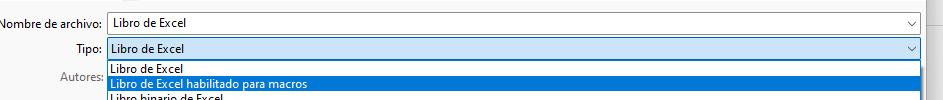
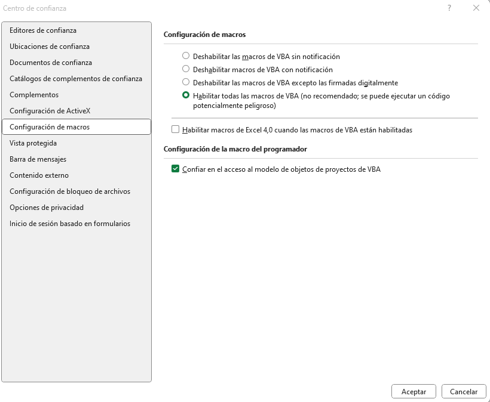
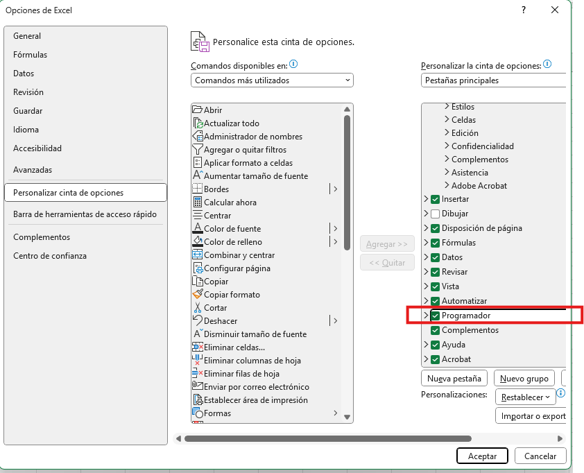
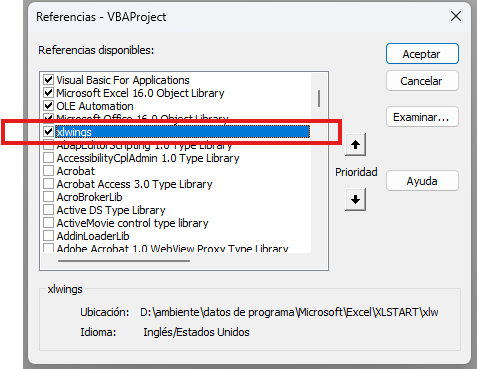
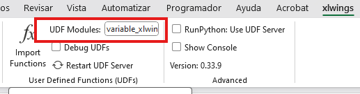
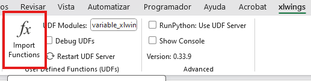

# Configuración del archivo excel

Para el correcto funcionamiento y uso de la clase VariableSIMEM es necesario que el archivo de excel cumpla con la siguiente configuración

## Pasos de configuración

1. Libro de excel habilitado para macros: Primero el archivo debe estar guardadado como `Libro de excel habilitado para macros`, es decir formato `xlsm` de la siguiente forma:

2. Habilitar macros: Para habilitar las macros nos dirijimos a `Opciones`, luego a `Centro de confianza` y accedemos a `Configuración del Centro de confianza`; allí accedemos a `Configuración de macros` y habilitamos las siguientes opciones:

3. Habilitar la barra Programador: Nuevamente en `Opciones`, accedemos a `Personalizar cinta de opciones` y habilitamaos la opción de `Programador` así:

4. Habilitar Xlwings en visual basic: En la barra de `Programador` accedemos inicialmente a `Visual Basic`, luego ingresamos a `Referencias` dentro de las opciones de la barra de `Herramientas` y habilitamos la opcion de `xlwings` de la siguiente forma:

5. Configurar modulo UDF: En la barra de `xlwings` ingresaremos el nombre del script de python en el apartado `UDF Modules` así:

6. Importar funciones: Finalmente en la barra de `xlwings` damos clic en la opción de `Import Functions`:

