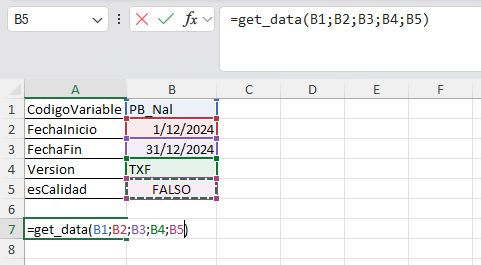
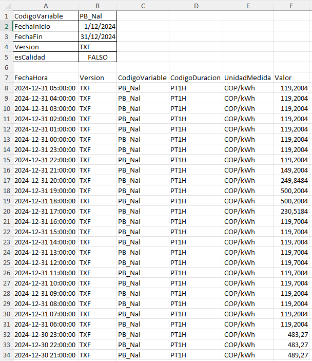

# Obtener datos en Excel

Para obtener los datos primero debemos tener un archivo de excel configurado con las instrucciones del apartado de `Configuración del archivo excel` ubicado en la misma dirección donde este el script de Python `variable_xlwings`, igualmente ya hay uno disponible para su uso dentro de la carpeta del proyecto

## Uso

Primero le asignamos un valor a los parámetros:

- CodigoVariable
- FechaInicio
- FechaFin
- Version
- quality_check

Luego ejecutamos la función como si fuera otra función común y corriente de excel: `=get_data(......)`

## Ejemplo

Las celdas deben quedar de la siguiente forma:

El resultado será el siguiente:

