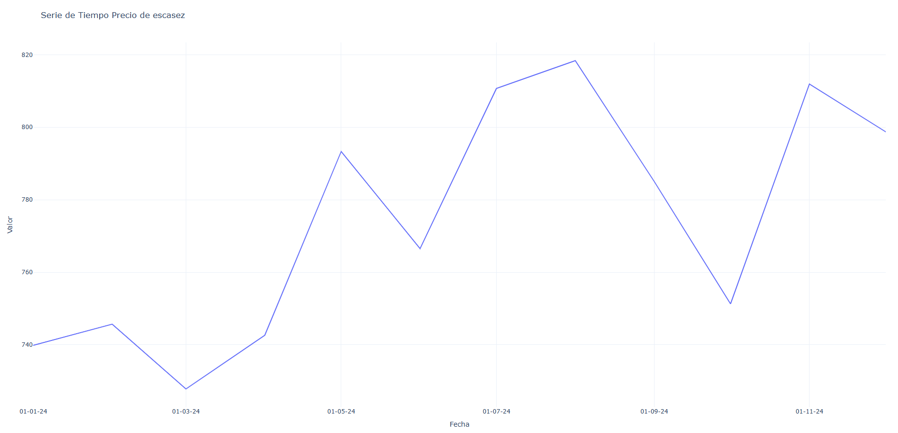

# Serie de tiempo de la variable

Esta función le permite al usuario obtener la serie de tiempo de la vairable entre el rango de fechas entregado, permitiéndole un mayor entendimiento de esta.

## Uso

Para obtener la serie de tiempo se debe ejecutar la siguiente instrucción:

```bash

from pydataxm.pydatasimem import VariableSIMEM

CodigoVariable = "PrecioEscasez"
Fecha_Inicio = "2024-01-01"
Fecha_Fin = "2024-12-31"

var = VariableSIMEM(CodigoVariable, Fecha_Inicio, Fecha_Fin)
var.time_series_data()

```

## Ejemplo

El resultado viene en un archivo .html, donde se podrá ver una serie de tiempo como la siguiente:

